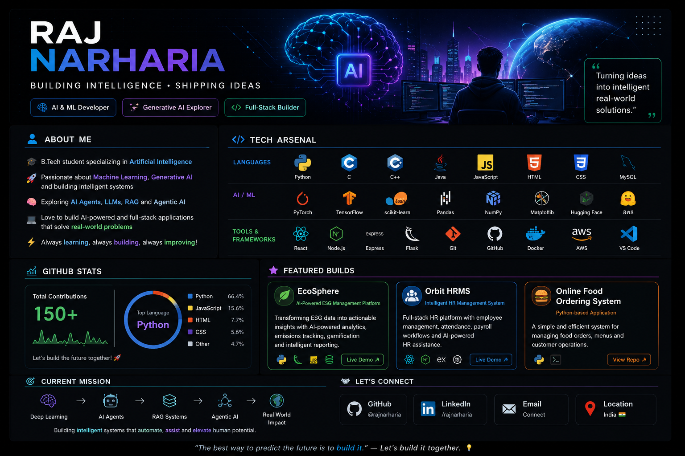

  

<h1 align="center">Raj Narharia</h1>

Artificial Intelligence Engineer • Machine Learning • Generative AI

Building intelligent software that solves real-world problems through AI, Machine Learning and modern software engineering.

<a href="https://github.com/rajnarharia">GitHub</a> •
<a href="https://www.linkedin.com/in/raj-narharia-rn-a04ba8329/">LinkedIn</a> •
<a href="mailto:rajnarharia0@gmail.com">Email</a>

---

# About Me

I am an Artificial Intelligence Engineering student passionate about designing intelligent systems that create practical impact.

Rather than building only academic projects, I enjoy developing complete AI applications—from data preprocessing and model training to deployment and user experience.

### Interests

- Artificial Intelligence
- Machine Learning
- Generative AI
- Computer Vision
- Natural Language Processing
- AI Automation
- LLM Applications
- Agentic AI

---

# Tech Stack

  

  

  

---

# Featured Projects

## 📰 NewsMind AI

An intelligent news clustering platform that groups related news articles using Natural Language Processing and Unsupervised Machine Learning.

**Tech Stack**

Python • NLP • Scikit-Learn • Streamlit

---

## 🎵 Music Genre Clustering AI

Discover hidden music patterns through unsupervised learning and interactive visual analytics.

**Tech Stack**

Python • PCA • K-Means • Plotly • Streamlit

---

## 🎨 PixelShrink AI

Compress thousands of image colors into optimized palettes while preserving image quality using K-Means clustering.

**Tech Stack**

Python • OpenCV • NumPy • Machine Learning

---
## 🤖 CustomDroid

An AI-powered Android assistant capable of understanding natural language commands and executing intelligent actions directly on Android devices.

**Tech Stack**

Kotlin • Jetpack Compose • Android • Generative AI

---

## 🌍 EcoSphere ESG Platform

An AI-powered ESG management platform that helps organizations monitor sustainability metrics and generate intelligent business insights.

**Tech Stack**

Python • FastAPI • PostgreSQL • Generative AI

---

# GitHub Analytics

  

---

# Currently Exploring

- 🤖 Agentic AI
- 🧠 Large Language Models (LLMs)
- 📚 Retrieval-Augmented Generation (RAG)
- ⚡ AI Automation
- ☁️ MLOps
- 🚀 Production AI Systems

---

# Let's Connect

&nbsp;&nbsp;&nbsp;

&nbsp;&nbsp;&nbsp;

---

### "Building AI that creates real-world impact."

